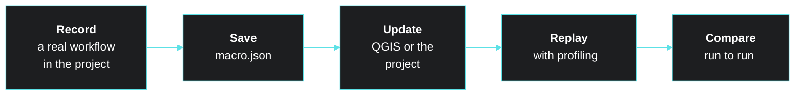

<div class="h-full flex flex-col justify-center text-left">

# Automated QGIS macro workflows

<div class="sub">...and performance monitoring</div>
<div class="who">Joona Laine · QGIS User Conference 2026</div>

<div class="workshop">

<div>
<div class="ws-label">Also at QUC 2026: workshop</div>
<div class="ws-title">Level up your QGIS plugin development skills</div>
<div class="ws-url"><a href="https://cofactor-company.github.io/quc2026-slides/qgis-plugin-dev-workshop/">cofactor-company.github.io/quc2026-slides/qgis-plugin-dev-workshop</a></div>
</div>
</div>

</div>

<CofactorLogo class="absolute bottom-10 right-14 text-3xl" />

<style>
h1 { font-size: 3rem !important; line-height: 1.1 !important; margin: 0 !important; color: var(--cofactor-fg) !important; }
h1 { background: linear-gradient(100deg, var(--cofactor-fg) 15%, var(--cofactor-accent) 65%, var(--cofactor-cyan)); -webkit-background-clip: text; background-clip: text; -webkit-text-fill-color: transparent; padding-bottom: 0.1em; }
.sub { color: var(--cofactor-accent); font-size: 1.6rem; margin-top: 0.5rem; }
.who { margin-top: 1.5rem; opacity: 0.8; }
.workshop { margin-top: 3rem; display: flex; gap: 1rem; align-items: center; background: var(--cofactor-bg-dark); border-radius: 0.5rem; padding: 0.8rem 1rem; width: max-content; }
.qr { width: 6rem; height: 6rem; border-radius: 0.3rem; display: block; }
.ws-label { font-size: 0.8rem; opacity: 0.7; text-transform: uppercase; letter-spacing: 0.06em; }
.ws-title { color: var(--cofactor-accent); font-weight: 700; }
.ws-url { font-size: 0.85rem; opacity: 0.8; font-family: var(--slidev-code-font-family, monospace); }
</style>

---
transition: slide-up
src: ./pages/bio.md
---

---

# How it all started

<div class="timeline mt-6">
<v-clicks>

<div class="step"><div class="dot">1</div><div><b>Editing got slow</b><span>Users reported freezes, and the cause took a long time to find</span></div></div>
<div class="step"><div class="dot">2</div><div><b>Profiling inside QGIS</b><span>QTimers added straight into the QGIS source</span></div></div>
<div class="step"><div class="dot">3</div><div><b>Measuring the freeze</b><span>How long until QGIS responds again</span></div></div>
<div class="step"><div class="dot">4</div><div><b>Fixed upstream</b><span>Free time: 1.3 s → 52 ms</span></div></div>
<div class="step"><div class="dot">5</div><div><b>Profiler plugin</b><span>Find the next one without editing QGIS source code</span></div></div>
<div class="step"><div class="dot">6</div><div><b>Macro plugin</b><span>Stop repeating the measurements by hand</span></div></div>

</v-clicks>
</div>

<style>
.timeline { position: relative; display: flex; flex-direction: column; gap: 0.7rem; }
.timeline::before { content: ""; position: absolute; left: 0.95rem; top: 1rem; bottom: 1rem; width: 2px; background: var(--cofactor-accent); opacity: 0.35; }
.step { position: relative; display: flex; align-items: center; gap: 1rem; }
.step b { color: var(--cofactor-accent); margin-right: 0.75rem; }
.step span { opacity: 0.85; }
.dot { flex-shrink: 0; width: 2rem; height: 2rem; border-radius: 9999px; background: var(--cofactor-bg-dark); border: 2px solid var(--cofactor-accent); color: var(--cofactor-accent); display: flex; align-items: center; justify-content: center; font-weight: 700; font-size: 0.9rem; }
.badge { margin-left: auto; font-size: 1.4rem; font-weight: 700; color: var(--cofactor-accent); background: var(--cofactor-bg-dark); border-radius: 0.5rem; padding: 0.2rem 0.8rem; }
.icon { margin-left: auto; height: 2.2rem; }
</style>

---

# Sound familiar?

<div class="grid grid-cols-3 gap-4 mt-8">
<div class="story" v-click>
<div class="story-value">Updates were a gamble</div>
<div class="story-desc">Three QGIS releases a year: would the critical workflows still work, and still be fast?</div>
</div>
<div class="story" v-click>
<div class="story-value">Testing by hand</div>
<div class="story-desc">Clicking through the same workflows again: slow, subjective, and no way to automate it inside QGIS</div>
</div>
<div class="story" v-click>
<div class="story-value">"It freezes for me"</div>
<div class="story-desc">The plugin runs fine on your machine, but users with other data and hardware say it freezes, and you can't see why</div>
</div>
</div>

<div v-click class="mt-10 text-2xl text-center">

That's what the two plugins are for

</div>

<style>
.story { background: var(--cofactor-bg-dark); border-radius: 0.5rem; padding: 1rem; }
.story-value { font-size: 1.25rem; font-weight: 700; color: var(--cofactor-accent); line-height: 1.25; margin-bottom: 0.5rem; }
.story-desc { font-size: 0.95rem; opacity: 0.85; }
</style>

---

# Macro plugin


> Record once, replay anywhere: automation without writing a single line of code

<div class="grid grid-cols-2 gap-4 mt-6">
<div class="card">
<div class="card-title">Record</div>
Mouse and keyboard events, straight from the Macro tab in Development Tools. No code
</div>
<div class="card">
<div class="card-title">Replay</div>
As many times as you want, at an adjustable speed
</div>
<div class="card">
<div class="card-title">Save and share</div>
Plain <code>.json</code> files that run in other environments and QGIS versions
</div>
<div class="card">
<div class="card-title">Profile the playback</div>
Each run is timed and shows up in the profiler
</div>
</div>

<div class="extra-ref above-footer">Use it as a library in your plugin? <Link to="extra-macro-api">Extra slides →</Link></div>

---

# Profiler plugin


> From the QGIS UI down to individual Python function calls, without touching the Python API

<div class="grid grid-cols-2 gap-4 mt-6">
<div class="card">
<div class="card-title">Record anything</div>
Hit Record, then pan, zoom and identify: every interaction lands in the tree
</div>
<div class="card">
<div class="card-title">Find the bottleneck</div>
Search events and hide everything under a time threshold
</div>
<div class="card">
<div class="card-title">Performance meters</div>
Recovery time after freezes, main thread health, map rendering time
</div>
<div class="card">
<div class="card-title">Down to Python calls</div>
cProfile any Python code and save <code>.prof</code> files for snakeviz or gprof2dot
</div>
</div>

<div class="extra-ref above-footer">Use it as a library in your plugin? <Link to="extra-profiler-api">Extra slides →</Link></div>

---

# Macro + Profiler

Record the workflow once, measure it in every environment and version

<div class="flex justify-center mt-6">



</div>

---

# What can you do with it?

<div class="grid grid-cols-2 gap-4 mt-8">
<div class="card">
<div class="card-title">End-to-end tests</div>
Repeatable test setups: replay critical workflows after every update and check they still work
</div>
<div class="card">
<div class="card-title">Automate repetitive tasks</div>
Anything you do by hand in QGIS, even digitizing or editing features
</div>
<div class="card">
<div class="card-title">Compare environments</div>
Rendering speeds and processing times across machines, QGIS versions and plugin versions
</div>
<div class="card">
<div class="card-title">Find bottlenecks</div>
Profile a replayed workflow and drill down to the slow layer or Python function
</div>
</div>

---
layout: center
class: text-center
---

# Live demo


---
layout: center
class: text-center
cofactorFooter: false
---

# Thank you!

Questions?

<div class="mt-10 grid grid-cols-[auto_auto_auto] gap-x-6 gap-y-2 text-left w-max mx-auto">
<div></div>
<div class="text-xs uppercase tracking-wider opacity-60">Plugin</div>
<div class="text-xs uppercase tracking-wider opacity-60">Library on PyPI</div>
<div class="text-right opacity-80">Profiler plugin</div>
<a href="https://github.com/Joonalai/profiler-qgis-plugin">github.com/Joonalai/profiler-qgis-plugin</a>
<a href="https://pypi.org/project/profiler-qgis-core/"><code>profiler-qgis-core</code></a>
<div class="text-right opacity-80">Macro plugin</div>
<a href="https://github.com/Joonalai/macro-qgis-plugin">github.com/Joonalai/macro-qgis-plugin</a>
<a href="https://pypi.org/project/macro-qgis-core/"><code>macro-qgis-core</code></a>
</div>

<div class="mt-12 opacity-80">Joona Laine · joona.laine@cofactor.fi</div>

<CofactorLogo class="block mt-4 text-3xl" />

<div class="extra-ref"><Link to="extra-profiler-api">Extra slides →</Link></div>

---
routeAlias: extra-profiler-api
---

# Extra: profiler in your own plugin

<div class="grid grid-cols-[1.35fr_1fr] gap-8 mt-6">
<div>

```python
from qgis_profiler.decorators import (
    cprofile_plugin,
    profile,
    profile_class,
)

@profile
def load_layers(): ...

@profile_class(exclude=["_private_method"])
class MyProcessor:
    def process(self): ...

@cprofile_plugin()
class MyPlugin:
    def initGui(self): ...
```

</div>
<div>

* `@profile` times one function
* `@profile_class` times every method of a class
* `@cprofile_plugin` runs cProfile over the whole plugin lifecycle
* Results show up in the same profiler tree as QGIS's own events
* **Calibrate** the meters to your machine's baseline in Settings

<div class="core-dep">

**Only need the library?** Add [`profiler-qgis-core`](https://pypi.org/project/profiler-qgis-core/) to `runtime_requires`, see the <a href="https://cofactor-company.github.io/quc2026-slides/qgis-plugin-dev-workshop/#/third-party-libraries?clicks=1" target="_blank">workshop slides</a>

</div>

</div>
</div>

<style>
.slidev-code { font-size: 16px !important; line-height: 24px !important; }
</style>

---
routeAlias: extra-macro-api
---

# Extra: macro core API

<div class="grid grid-cols-[1.3fr_1fr] gap-8 mt-6">
<div>

```python
from qgis_macros.macro_player import MacroPlayer
from qgis_macros.macro_recorder import MacroRecorder

recorder = MacroRecorder()
recorder.start_recording()
# ... user interactions ...
macro = recorder.stop_recording()

MacroPlayer(playback_speed=1.5).play(macro)
```

</div>
<div>

* The core libraries `qgis_macros` and `qgis_profiler` work without the plugin UI
* Record and replay macros from your own scripts

<div class="core-dep">

**Only need the library?** Add [`macro-qgis-core`](https://pypi.org/project/macro-qgis-core/) to `runtime_requires`, see the <a href="https://cofactor-company.github.io/quc2026-slides/qgis-plugin-dev-workshop/#/third-party-libraries?clicks=1" target="_blank">workshop slides</a>

</div>

</div>
</div>

<style>
.slidev-code { font-size: 17px !important; line-height: 26px !important; }
</style>
