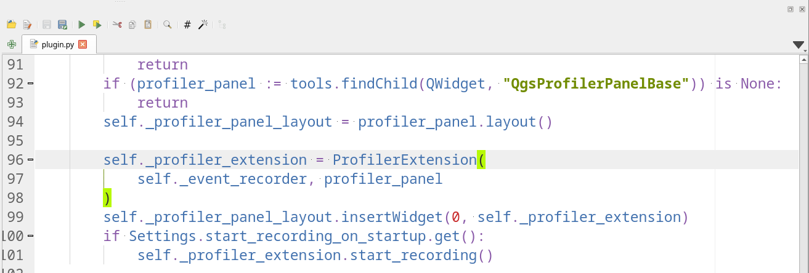
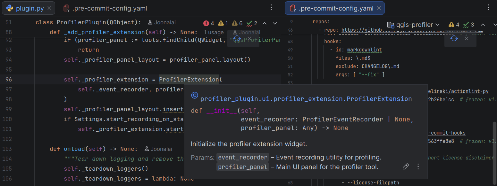
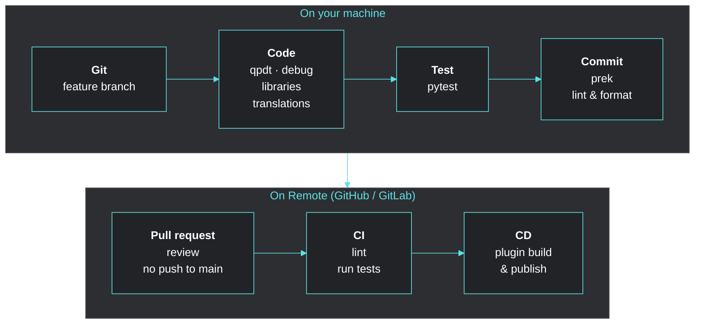
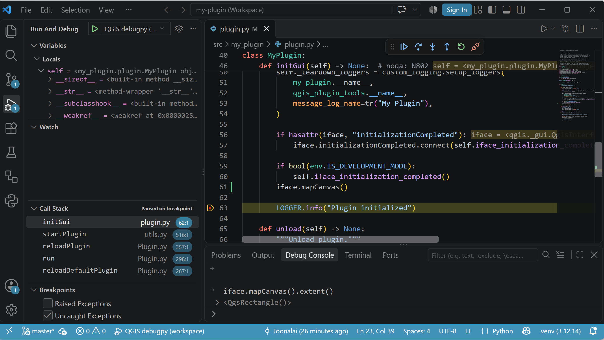
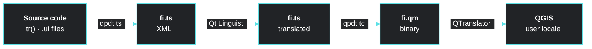
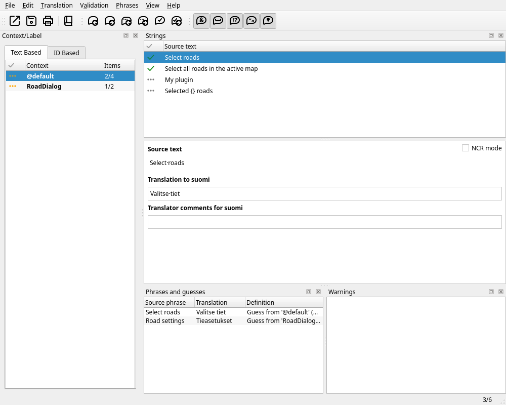
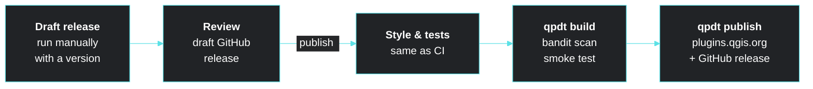

<div class="h-full flex flex-col justify-center text-left">

# Level up your QGIS plugin development skills

<div class="sub">Hands-on workshop</div>
<div class="who">Joona Laine <span class="org">Cofactor</span> · Riikka Nousiainen <span class="org">Vektorila</span></div>
<div class="who2">QGIS User Conference 2026</div>

<div class="talk">
<div class="qr">QR</div>
<div>
<div class="talk-label">Also at QUC 2026: talk</div>
<div class="talk-title">Automated QGIS macro workflows</div>
<div class="talk-url">slides: <span class="fill">[link]</span></div>
</div>
</div>

</div>

<!-- TODO: replace [link] and the QR placeholder with the macro talk slides URL once the Netlify site is live -->

<style>
h1 { font-size: 2.8rem !important; line-height: 1.1 !important; margin: 0 !important; color: var(--cofactor-fg) !important; max-width: 46rem; }
h1 { background: linear-gradient(100deg, var(--cofactor-fg) 15%, var(--cofactor-accent) 65%, var(--cofactor-cyan)); -webkit-background-clip: text; background-clip: text; -webkit-text-fill-color: transparent; padding-bottom: 0.1em; }
.sub { color: var(--cofactor-accent); font-size: 1.5rem; margin-top: 0.6rem; }
.who { margin-top: 1.5rem; opacity: 0.9; }
.who2 { opacity: 0.7; font-size: 0.95rem; margin-top: 0.2rem; }
.org { opacity: 0.7; }
.talk { margin-top: 2.5rem; display: flex; gap: 1rem; align-items: center; background: var(--cofactor-bg-dark); border-radius: 0.5rem; padding: 0.8rem 1rem; width: max-content; }
.qr { width: 4.5rem; height: 4.5rem; border: 2px dashed #ffd166; color: #ffd166; display: flex; align-items: center; justify-content: center; font-weight: 700; border-radius: 0.3rem; }
.talk-label { font-size: 0.8rem; opacity: 0.7; text-transform: uppercase; letter-spacing: 0.06em; }
.talk-title { color: var(--cofactor-accent); font-weight: 700; }
.talk-url { font-size: 0.85rem; opacity: 0.8; font-family: var(--slidev-code-font-family, monospace); }
.fill { color: #ffd166; border-bottom: 1px dashed #ffd166; }
</style>

---
src: ./pages/bio-workshop.md
---

---

# Why are we here

* We have a large team working with the same QGIS plugin codebase
* Team members have different skill levels
* Need to have **opinionated** professional plugin development practices
  * **Proven, not perfect**: There are always other approaches and newer tools out there, but this setup has worked for us and makes code easier to test, extend, and maintain

<br/>

<v-click>

> [!NOTE] Goal
> The goal of this workshop is simply to share our setup with you, show you why it works for us, and help you apply it to your own work.


</v-click>

<br/>
<v-click>

>[!QUESTION]
> How many of you have experience with QGIS plugin development?

</v-click>


---

# Workshop agenda

<div class="grid grid-cols-2 gap-10 mt-6">
<div>

* Introduce development tools
* Introduce development methods and best practices
* Creating your own plugin with a development environment set up from a template
* Hands-on exercises

</div>
<div>

<div class="schedule">
<div class="time">9:00</div>
<div>Development tools and environment setup</div>
<div class="time">10:30</div>
<div>Coffee break</div>
<div class="time">11:00</div>
<div>Development methods and best practices<br></div>
<div class="time">12:30</div>
<div>Lunch</div>
</div>

</div>
</div>

<style>
.schedule { display: grid; grid-template-columns: auto 1fr; column-gap: 1.25rem; row-gap: 1rem; border-left: 2px solid var(--cofactor-accent); padding-left: 1.25rem; }
.schedule .time { color: var(--cofactor-accent); font-variant-numeric: tabular-nums; font-weight: 700; }
</style>

---

# Professional QGIS plugin development

* Development experience does not have to differ from professional Python development

<div class="relative h-[345px] mt-4">
<figure class="absolute left-0 top-0 w-[58%] m-0">

<figcaption class="absolute -top-3 left-3 px-2 py-0.5 rounded bg-[#212326] text-xs">QGIS Python editor</figcaption>
</figure>
<figure v-click class="absolute right-0 bottom-0 w-[64%] m-0">

<figcaption class="absolute -top-3 left-3 px-2 py-0.5 rounded bg-[#212326] text-xs">PyCharm</figcaption>
</figure>
</div>

---


# Development tools

The tools used in this workshop:

<div class="grid grid-cols-4 gap-3 mt-4 text-sm">
<div class="tool-card">
<div class="tool-name">Python</div>
Ships with QGIS, hopefully familiar :)
</div>
<div class="tool-card">
<div class="tool-name">uv</div>
A modern Python package and project manager
</div>
<div class="tool-card">
<div class="tool-name">qgis-venv-creator</div>
Python virtual environment linked to QGIS libraries
</div>
<div class="tool-card">
<div class="tool-name">qgis-plugin-dev-tools</div>
A tool to run, debug, package, and publish the plugin
</div>
<div class="tool-card">
<div class="tool-name">qgis_plugin_tools</div>
Shared helpers: logging, resources, translations
</div>
<div class="tool-card">
<div class="tool-name">pytest-qgis</div>
Fixtures for testing plugins with pytest
</div>
<div class="tool-card">
<div class="tool-name">flake8-qgis</div>
Linter rules for QGIS-specific pitfalls
</div>
<div class="tool-card">
<div class="tool-name">ruff</div>
An extremely fast Python linter and code formatter
</div>
<div class="tool-card">
<div class="tool-name">mypy</div>
An automatic type checker for Python code
</div>
<div class="tool-card">
<div class="tool-name">prek</div>
A fast tool running automatic code checks before Git commits
</div>
<div class="tool-card col-span-2">
<div class="tool-name">qgis-plugin-copier-template</div>
Creates a new plugin project with all of the above set up
</div>
</div>

<style>
.tool-card { background: var(--cofactor-bg-dark); border-radius: 0.5rem; padding: 0.7rem 0.9rem; }
.tool-name { font-family: var(--slidev-code-font-family, monospace); color: var(--cofactor-accent); margin-bottom: 0.25rem; }
.tool-card.later { background: transparent; border: 1px dashed rgba(255, 255, 255, 0.25); }
</style>

---

# qgis-plugin-copier-template

> [!PROBLEM] Setting up all these tools for every new plugin takes time, and every project ends up different

<v-click>
<a href="https://github.com/osgeosuomi/qgis-plugin-copier-template">qgis-plugin-copier-template</a>
creates a new plugin project with a working example plugin and every tool in this workshop set up.

<div class="grid grid-cols-[0.9fr_1.1fr] gap-5 mt-3">
<div>

```text
my-plugin/
├── .github/workflows/ # CI / CD pipelines
├── src/my_plugin/
│   ├── plugin.py      # the plugin class
│   ├── env.py         # environment variables
│   ├── metadata.txt
|   ├── utils/         # utility modules
│   └── resources/     # icons, translations 
├── test/              # pytest-qgis tests
├── pyproject.toml     # dependencies, qpdt config
├── .env.example
├── .pre-commit-config.yaml
├── CHANGELOG.md
├── README.md
└── DEVELOPMENT.md

```

</div>
<div>

```sh
# create the plugin project
copier copy --answers-file .copier-answers.qgis-plugin.yml \
  https://github.com/osgeosuomi/qgis-plugin-copier-template.git .
uv sync
uv run prek install
```

```sh
# later: pull in template improvements
copier update --answers-file .copier-answers.qgis-plugin.yml \
  --skip-answered
```

</div>
</div>

<style>
.slidev-code { font-size: 12px !important; line-height: 17px !important; }
</style>

<!--
plugin.py already imports qgis_plugin_tools (logging, tr()). Mention it in one sentence here, the details come in "Libraries" after the break.
-->

<div class="extra-ref">What about Plugin Builder or Cookiecutter templates? <Link to="extra-plugin-builder">Extra slides →</Link></div>
</v-click>
---


# How to make QGIS imports work

> [!PROBLEM] Opening the plugin in an IDE shows import errors and no autocomplete for QGIS

<v-click>

* Python does not recognize QGIS types since they are not in the **environment**

Possible solutions:

<div class="flex flex-col items-start gap-3 mt-4">
<div class="option" :class="{ 'opacity-40': $clicks >= 2 }"><span class="option-letter">A</span> Use the Python shipped with QGIS</div>
<div class="option" :class="{ 'opacity-40': $clicks >= 2 }"><span class="option-letter">B</span> Copy Python <code>.pyi</code> files from the QGIS installation directory</div>
<div class="option" v-mark="{ at: 2, type: 'box', color: '#00ffff', padding: 6 }"><span class="option-letter">C</span> Use a QGIS-aware Python virtual environment (venv)</div>
</div>

</v-click>

<style>
.option { display: flex; align-items: center; gap: 0.75rem; transition: opacity 0.3s; }
.option-letter { display: inline-flex; align-items: center; justify-content: center; width: 1.8rem; height: 1.8rem; border-radius: 9999px; background: var(--cofactor-bg-dark); color: var(--cofactor-accent); font-weight: 700; }
</style>


<!--
Ask the audience to vote A, B or C before the click.

A: works, but you install dev tools (ruff, mypy, pytest...) into QGIS's own Python and every plugin shares them.
B: autocomplete only, no way to run tests or tools against QGIS.
C: isolated per project, sees QGIS libraries, and dev tools stay out of the QGIS installation.
-->

---

# Python virtual environment

<div class="grid grid-cols-2 gap-10 mt-4">
<div>

* Isolated Python installation for a specific project
* Contains its own Python executable and installed packages
* Why we should use them:
    * Avoid dependency conflicts
    * Create reproducible environment
    * Prevents polluting system python

</div>
<div v-click>

### Based on any Python

<div class="venv-stack mt-3">
<div class="venv-layer venv-own">
<div class="venv-name">.venv</div>
your project's own packages
</div>
<div class="venv-arrow">based on ↓</div>
<div class="grid grid-cols-3 gap-2">
<div class="venv-layer">system Python</div>
<div class="venv-layer">uv / pyenv Python</div>
<div class="venv-layer venv-qgis">Python shipped with <b>QGIS</b></div>
</div>
</div>

* A venv can be created from **any** Python interpreter
* Based on the QGIS Python with system site packages, it **sees the QGIS libraries**: `qgis`, PyQt, `osgeo`

</div>
</div>

<style>
.venv-stack { display: flex; flex-direction: column; align-items: stretch; gap: 0.25rem; font-size: 0.85rem; }
.venv-layer { background: var(--cofactor-bg-dark); border-radius: 0.5rem; padding: 0.6rem 0.9rem; }
.venv-own { border: 1px solid var(--cofactor-accent); }
.venv-qgis { border: 1px solid var(--cofactor-accent); color: var(--cofactor-accent); }
.venv-name { font-family: var(--slidev-code-font-family, monospace); color: var(--cofactor-accent); }
.venv-arrow { text-align: center; opacity: 0.6; font-size: 0.75rem; }
</style>

<!--
The venv inherits the interpreter it was created from. Windows / macOS bundle their own Python inside QGIS; on Linux QGIS uses the system Python.
-->


---
transition: fade
---

# qgis-venv-creator

[qgis-venv-creator](https://github.com/GispoCoding/qgis-venv-creator) provides an easy way to 
install QGIS venv for all platforms.

* Allows choosing from all installed QGIS versions
* It also patches some DLL errors on Windows
* Alternative: [pixi](https://pixi.sh) or conda install QGIS itself from conda-forge into the project environment, pinned per project

```sh
create-qgis-venv   # in the plugin root, asks which QGIS installation to use
```

<br/>

> [!tip]
> On Linux, QGIS uses the system Python, so a plain venv with system site packages works too:
>
> ```sh
> python3 -m venv --system-site-packages .venv
> # or with uv
> UV_PYTHON=/usr/bin/python3 uv venv --system-site-packages
> ```

---
transition: fade
---


# Exercise: initial plugin with copier template
<!-- 30min reserved -->

<!-- TODO: link to exerices -->
<div class="talk-url mt-6">Link to exercise: <span class="fill">[link]</span></div>

<style>
.fill { color: #ffd166; border-bottom: 1px dashed #ffd166; }
</style>


---

# How to get plugin code run on QGIS?

The common ways to get your code into QGIS while developing:

<div class="grid grid-cols-3 gap-5 mt-3 text-sm">
<div class="way">

### Copy with [pb_tool](https://github.com/jonah-sullivan/plugin_build_tool)

* `pb_tool deploy` copies the files listed in `pb_tool.cfg` into the profile
* Every new file must be added to the list
* Runtime dependencies still go into QGIS's Python by hand
* QGIS runs from its own Python, not your venv

</div>
<div class="way">

### Edit in the plugins directory

* Code lives inside a QGIS profile, not in your project
* Easy to lose work when the plugin is reinstalled
* Hard to keep under version control

</div>
<div class="way">

### Symlink the repository

* Symlinks need extra permissions on Windows
* Runtime dependencies go into QGIS's Python by hand
* All plugins share them, so versions can conflict

</div>
</div>

<div class="answer text-sm" v-click>

**qgis-plugin-dev-tools**: QGIS starts **from your venv** with the plugin installed and a debugger attached, and runtime dependencies are **vendored into the zip**

</div>

<!--
pb_tool is a good tool and the default in Plugin Builder: it compiles .ui/.qrc files, builds Sphinx docs, compiles translations and zips the plugin, and it supports QGIS 3 and 4.
The difference is the development loop: pb_tool copies files into your QGIS profile, while qpdt runs QGIS from your project's venv, so dev tools, the debugger and PyPI dependencies just work, and the released zip bundles those dependencies.
-->

<style>
.way { background: var(--cofactor-bg-dark); border-radius: 0.5rem; padding: 0.2rem 1rem 0.6rem; }
.way h3 { font-size: 1.05rem; color: var(--cofactor-accent); margin-top: 0.6rem; }
.answer { margin-top: 0.9rem; border-left: 3px solid var(--cofactor-accent); padding: 0.4rem 0 0.4rem 1rem; }
</style>

---

# qgis-plugin-dev-tools (developing the plugin)

[qgis-plugin-dev-tools](https://github.com/nlsfi/qgis-plugin-dev-tools) launches QGIS **from your project's venv**, with the plugin installed and enabled.

<div class="grid grid-cols-[1fr_1.1fr] gap-8 mt-4">
<div>

1. Point `.env` to your QGIS executable
2. `qpdt start` launches QGIS with
   * the plugin installed from your project
   * all venv packages available
   * an optional debugger attached
3. Edit code, reload with [Plugin Reloader](https://plugins.qgis.org/plugins/plugin_reloader)

<p class="text-sm opacity-70 mt-6">Packaging and releasing with <code>qpdt build</code>: after the break</p>

</div>
<div>

```toml [pyproject.toml]
[tool.qgis_plugin_dev_tools]
plugin_package_name = "my_plugin"
```

```dotenv [.env]
QGIS_EXECUTABLE_PATH=/usr/bin/qgis
DEBUGGER_LIBRARY=debugpy
# DEVELOPMENT_PROFILE_NAME=
```

```sh
qpdt start    # launch QGIS with the plugin
```

</div>
</div>

---


# Code formatting and linting

<div class="grid grid-cols-2 gap-8 mt-6">
<div class="tool-card">
<div class="tool-kind">Formatter</div>
<div class="tool-role">rewrites <b>how</b> code looks</div>

```python
# before
layer=QgsVectorLayer( path,'roads',"ogr" )
# after
layer = QgsVectorLayer(path, "roads", "ogr")
```

* Same style for the whole team
* No time spent on spacing and indentation
* Safe to run automatically: behavior never changes

</div>
<div class="tool-card" v-click>
<div class="tool-kind">Linter</div>
<div class="tool-role">reports <b>what</b> looks wrong</div>

```console
$ ruff check
F401 `os` imported but unused
F821 Undefined name `QgsProjet`
C901 `run` is too complex (14 > 10)
```

* Looks for mistakes, suspicious code and bad practices
* Hundreds of rules, e.g. typos, unused variables, missing imports, complex functions, ...
* Catches bugs before users find them

</div>
</div>

<style>
.tool-card { background: var(--cofactor-bg-dark); border-radius: 0.5rem; padding: 1rem 1.25rem; }
.tool-kind { font-size: 1.4rem; font-weight: 700; color: var(--cofactor-accent); }
.tool-role { opacity: 0.75; margin-bottom: 0.5rem; }
.slidev-code { font-size: 12.5px !important; line-height: 19px !important; }
</style>

---

# Code review becomes style review?

> [!PROBLEM] Review comments about whitespace and import order, while real bugs slip through

<v-click>
<div class="grid grid-cols-2 gap-10 mt-4">
<div>

* Everyone formats code a bit differently
* Diffs full of unrelated formatting changes
* Simple bugs slip through: unused imports, bare `except`, `None` where a layer was expected

</div>
<div>

* Let **tools** decide style, humans review logic
* A **formatter** makes everyone's code look the same
* **Linters** and a **type checker** catch the simple bugs before review

</div>
</div>
</v-click>

---

# flake8-qgis: QGIS-specific checks

> [!PROBLEM] Generic linters don't know QGIS pitfalls, like code that breaks on QGIS 4 / Qt6

<v-click>
<div class="grid grid-cols-[1fr_1.2fr] gap-6 mt-4">
<div>

```python
from PyQt5.QtCore import pyqtSignal
import gdal

class MyDialog(QDialog):
    def run(self) -> None:
        self.exec_()
        project = QgsProject.instance()
        project.write("project.qgz")
```

</div>
<div>

```console
$ flake8
QGS103 Use 'from qgis.PyQt.QtCore import
       pyqtSignal' instead of 'from PyQt5...'
QGS106 Use 'from osgeo import gdal'
       instead of 'import gdal'
QGS107 Use 'exec' instead of 'exec_'
QGS201 Check the success flag and possibly error
       message from return value of QgsProject.write()
```

</div>
</div>

* [flake8-qgis](https://github.com/osgeosuomi/flake8-qgis) rules: `QGS1xx` common rules, `QGS2xx` return values, `QGS4xx` Qt6 / QGIS 4 rules
* The template also runs **flake8-spellcheck** on names, with project words in `whitelist.txt`
</v-click>

---

# Ruff: formatting and linting Python

> [!PROBLEM] Dozens of separate tools (black, isort, flake8, ...), each with its own config

<v-click>
<a href="https://docs.astral.sh/ruff/">Ruff</a> is a single, very fast tool for both formatting and linting.

<div class="grid grid-cols-[1fr_1.15fr] gap-6 mt-4">
<div>

```python
import os
from qgis.core import QgsVectorLayer


def load_layers(paths, layers=[]):
    for path in paths:
        try:
            layers.append(
                QgsVectorLayer(path, "l", "ogr")
            )
        except:
            print("Failed to load " + path)
    return layers
```

</div>
<div>

```console
$ ruff check
F401 [*] `os` imported but unused
ANN001 Missing type annotation for `paths`
B006 Do not use mutable data structures
     for argument defaults
E722 Do not use bare `except`
T201 `print` found
...
```

* Template enables **all** rules: `select = ["ALL"]`, with a short list of ignores
* `ruff format` formats, `ruff check --fix` fixes what it can

</div>
</div>
</v-click>
---
transition: fade
---

# Mypy: type checking

> [!PROBLEM] The QGIS API returns <code>None</code> or a base class more often than you think

<div class="grid grid-cols-2 gap-6 mt-4">
<div>

```python
def select_roads(
    project: QgsProject, layer_id: str
) -> int:
    layer = project.mapLayer(layer_id)
    layer.selectByExpression("\"class\" = 'main'")
    return layer.selectedFeatureCount()
```

```console
$ mypy
error: Item "QgsMapLayer" of "QgsMapLayer | None"
       has no attribute "selectByExpression"
error: Item "None" of "QgsMapLayer | None"
       has no attribute "selectByExpression"
... (2 more for selectedFeatureCount)
```

</div>
<div v-click>

```python
def select_roads(
    project: QgsProject, layer_id: str
) -> int:
    layer = project.mapLayer(layer_id)
    if not isinstance(layer, QgsVectorLayer):
        return 0
    layer.selectByExpression("\"class\" = 'main'")
    return layer.selectedFeatureCount()
```

* [Mypy](https://mypy-lang.org/) reads the type hints of your code and the QGIS `.pyi` stubs
* Catches the bug before a user without a vector layer does
* Type hints double as documentation and power IDE autocomplete

</div>
</div>

<style>
.slidev-code { font-size: 12px !important; line-height: 18px !important; }
</style>

---
transition: fade
---

# Exercise/live demo: formatting and linting tools

<!-- TODO: link to exerices -->
<div class="talk-url mt-6">Link to exercise: <span class="fill">[link]</span></div>
<!-- Ensure that typign works for all, move py.typed to correct dir -->

---

# Committing changes

> [!PROBLEM] The checks only help if everyone remembers to run them

<v-click>
<div class="grid grid-cols-2 gap-10 mt-4">
<div>

**Pre-commit hooks** run automatically before Git creates a commit

* The same Ruff, flake8 and mypy checks as your IDE
* Plus other checks and fixes for any file type
* Run again in **CI**, in case a hook was skipped

</div>
<div>

[prek](https://prek.j178.dev) runs the hooks:

```sh
prek install          # once per clone
git commit            # checks changed files
prek run --all-files  # check everything
```

</div>
</div>
</v-click>

<!--
prek is a faster drop-in replacement for pre-commit, it reads the same .pre-commit-config.yaml.
-->

---

# Pre-commit hooks in the template

<div class="grid grid-cols-4 gap-3 mt-6 text-sm">
<div class="hook-card">
<div class="hook-name">ruff</div>
Format and lint Python, fix what it can
</div>
<div class="hook-card">
<div class="hook-name">flake8</div>
flake8-qgis checks for QGIS pitfalls and spellcheck
</div>
<div class="hook-card">
<div class="hook-name">mypy</div>
Type check against the QGIS API
</div>
<div class="hook-card">
<div class="hook-name">bandit</div>
Common security issues in Python code
</div>
<div class="hook-card">
<div class="hook-name">pre-commit-hooks</div>
Whitespace, line endings, valid YAML / JSON, large files, merge conflicts
</div>
<div class="hook-card">
<div class="hook-name">taplo · markdownlint</div>
Format TOML files, lint and fix Markdown
</div>
<div class="hook-card">
<div class="hook-name">actionlint</div>
Catch errors in GitHub Actions workflows
</div>
<div class="hook-card">
<div class="hook-name">insert-license</div>
Optional copyright header in every source file
</div>
<div class="hook-card col-span-2">
<div class="hook-name">qgis-plugin-dev-tools</div>
Update translation files, normalize Qt Designer <code>.ui</code> XML
</div>
<div class="hook-card col-span-2">
<div class="hook-name">gitlint</div>
Commit messages follow <a href="https://www.conventionalcommits.org/">Conventional Commits</a> (<code>feat:</code>, <code>fix:</code>, ...)
</div>
</div>

<style>
.hook-card { background: var(--cofactor-bg-dark); border-radius: 0.5rem; padding: 0.8rem 1rem; }
.hook-name { font-family: var(--slidev-code-font-family, monospace); color: var(--cofactor-accent); margin-bottom: 0.25rem; }
</style>

<!--
Top row: the Python checks from the previous slides, same config as in the IDE.
-->


---
transition: fade
---

# Git: Conventional Commits

> [!PROBLEM] A history full of "fix", "wip" and "changes", and nobody knows what changed or why

<v-click>
<div class="grid grid-cols-[1.1fr_1fr] gap-8 mt-4">
<div>

```text
<type>(<optional scope>): <description>

feat: add road selection tool
fix(ui): keep dialog open after a failed save
docs: document the translation workflow
```

* **Types**: `feat`, `fix`, `docs`, `refactor`, `test`, `perf`, `style`, `ci`, `chore`
* `feat` and `fix` tell you what goes into the changelog and whether the next version is minor or patch
<!-- * Work in a feature branch and open a pull request: **no pushes to main** -->

</div>
<div>

**gitlint** checks every commit message, in the `commit-msg` hook and again in CI for pull requests:

```console
$ git commit -m "Fixed stuff"
CT1 Title does not follow ConventionalCommits.org
    format 'type(optional-scope): description'
T7 Title does not match regex (: [^A-Z])
```

* Template rules: title at most 72 characters, lowercase after the colon, no "WIP"

</div>
</div>
</v-click>
<style>
.slidev-code { font-size: 12.5px !important; line-height: 19px !important; }
</style>

---
transition: fade
---

# Break

----

# Development practices

From a branch to a released plugin

<div class="flex justify-center">



</div>

<!--
The rest of the workshop goes through these one by one, with an exercise after each.
-->

---


# Debugging: more than LOGGER.debug()

> [!PROBLEM] <code>LOGGER.debug()</code> calls everywhere, then restart QGIS and try again

<v-click>
<div class="grid grid-cols-[1fr_1.2fr] gap-6 mt-4">
<div>

```dotenv [.env]
DEBUGGER_LIBRARY=debugpy
```

1. `qpdt start`: QGIS starts with **debugpy** listening on port 5678, no debugger plugin (like debugvs) needed
2. In VS Code, run **QGIS debugpy**: the attach config ships in the template's workspace file
3. Set breakpoints, inspect variables, and step through the plugin **inside QGIS**
4. Edit, reload with Plugin Reloader, and keep debugging without a restart

</div>
<div>

<!-- TODO: add VS Code screenshot, e.g.  -->
<div class="screenshot-placeholder">VS Code screenshot</div>

<div class="text-sm mt-3">

> [!tip] PyCharm / IntelliJ IDEA
> `DEBUGGER_LIBRARY=pydevd` + `pydevd-pycharm` matching the IDE. Start a **Python Debug Server** on port 5678 *before* `qpdt start`

</div>

</div>
</div>
</v-click>

<!--
PyCharm / IDEA: the order matters. pydevd connects to the IDE, while debugpy waits for the IDE to attach, so the Python Debug Server must already be running when QGIS starts.

Tests can be debugged the same way from the IDE's test runner, no QGIS needed.
-->

<style>
.slidev-code { font-size: 12.5px !important; line-height: 19px !important; }
.screenshot-placeholder { height: 230px; border: 2px dashed var(--cofactor-accent); border-radius: 0.5rem; display: flex; align-items: center; justify-content: center; opacity: 0.5; }
</style>

---

# Next step from manual testing

> [!PROBLEM] Manual testing is slow, never quite the same twice, and makes refactoring scary

<v-click>
<div class="grid grid-cols-2 gap-10 mt-4">
<div>

### Why not plain pytest?

* PyQGIS needs a running `QgsApplication`
* `iface` exists only inside the QGIS application
<!-- * Layers left behind can crash the test run (segfault) -->

</div>
<div>

### [pytest-qgis](https://github.com/osgeosuomi/pytest-qgis)

* Starts `QgsApplication` once per test session
* Replaces `qgis.utils.iface` with a test stub
* Cleans the project and layer fixtures between tests
* Fixtures for common needs: project, canvas, processing, sample data

```sh
uv run pytest
```

</div>
</div>
</v-click>

---

# Example


<div class="grid grid-cols-2 gap-6 mt-4">
<div>

```python [test/conftest.py]
@pytest.fixture
def roads_layer() -> QgsVectorLayer:
    layer = QgsVectorLayer(
        "LineString?field=class:string",
        "roads",
        "memory",
    )
    for road_class in ["main", "main", "local"]:
        feature = QgsFeature(layer.fields())
        feature["class"] = road_class
        feature.setGeometry(
          QgsGeometry.fromWkt("LINESTRING(0 0, 1 1)")
        )
        layer.dataProvider().addFeature(feature)
    return layer
```

* A memory layer is fast and needs no files

</div>
<div>

```python [test/test_selection.py]
def test_select_roads_selects_main_roads(
    roads_layer: QgsVectorLayer,
) -> None:
    QgsProject.instance().addMapLayer(roads_layer)

    count = select_roads(
        qgis_new_project, roads_layer.id()
    )

    assert count == 2
    assert roads_layer.selectedFeatureCount() == 2
```

* `qgis_new_project` gives a clean `QgsProject` for every test
* Fixtures with `layer` in the name are cleaned up automatically

</div>
</div>

<style>
.slidev-code { font-size: 12.5px !important; line-height: 19px !important; }
</style>

---

# Testing code that uses iface

> [!PROBLEM] Plugin code talks to the user through <code>iface</code>, but a test can't see the message bar

<v-click>
<div class="grid grid-cols-[1.3fr_1fr] gap-6 mt-4">
<div>

```python
def test_select_roads_warns_without_layer(
    qgis_new_project: QgsProject,
    qgis_iface: QgisInterface,
) -> None:
    assert select_roads(qgis_new_project, "missing") == 0

    bar = qgis_iface.messageBar()
    assert bar.get_messages(Qgis.MessageLevel.Warning) == [
        "Roads: No roads found for class 'missing'",
    ]
```

</div>
<div>

* `qgis_iface` is a stub `QgisInterface` with a real map canvas
* The message bar **records** messages for asserts
* Methods it doesn't implement return a `MagicMock`, so calls can be asserted too
* The template's first test loads the whole plugin:

```python
plugin = classFactory(qgis_iface)
plugin.initGui()
...
plugin.unload()
```

</div>
</div>
</v-click>

<style>
.slidev-code { font-size: 12.5px !important; line-height: 19px !important; }
</style>

---

# Processing and widgets

> [!NOTE]
> Processing algorithms and dialogs need more than a plain `QgsApplication`

<div class="grid grid-cols-2 gap-6 mt-4">
<div>

```python
@pytest.mark.usefixtures("qgis_processing")
def test_buffer_roads(roads_layer: QgsVectorLayer):
    result = processing.run("native:buffer", {
        "INPUT": roads_layer,
        "DISTANCE": 10,
        "OUTPUT": QgsProcessing.TEMPORARY_OUTPUT,
    })

    assert result["OUTPUT"].featureCount() == 3
```

</div>
<div>

```python
# Widgets with pytest-qt
def test_select_button_accepts_dialog(
    qtbot: QtBot,
) -> None:
    dialog = RoadDialog()
    qtbot.addWidget(dialog)

    left = Qt.MouseButton.LeftButton
    with qtbot.waitSignal(dialog.accepted):
        qtbot.mouseClick(dialog.button, left)
```

</div>
</div>

* `qgis_processing` registers the native algorithms once per session
  * Also plugin's own algorithms [can be tested](https://github.com/osgeosuomi/pytest-qgis/issues/27#issuecomment-1290016707)
* [pytest-qt](https://pytest-qt.readthedocs.io/) `qtbot` clicks buttons, uses the keyboard, and waits for signals
* Use `--qgis_disable_gui` to keep the widgets hidden

<style>
.slidev-code { font-size: 12.5px !important; line-height: 19px !important; }
</style>

---

# More fixtures and tools

<div class="grid grid-cols-3 gap-4 mt-6 text-sm">
<div class="fixture-card">
<div class="fixture-name">qgis_new_project</div>
Clean <code>QgsProject</code> for the test
</div>
<div class="fixture-card">
<div class="fixture-name">qgis_iface</div>
Stub <code>QgisInterface</code>, also patched into <code>qgis.utils.iface</code>
</div>
<div class="fixture-card">
<div class="fixture-name">qgis_processing</div>
Initializes the processing framework for <code>processing.run(...)</code>
</div>
<div class="fixture-card">
<div class="fixture-name">qgis_canvas</div>
The <code>QgsMapCanvas</code> used by <code>qgis_iface</code>
</div>
<div class="fixture-card">
<div class="fixture-name">qgis_countries_layer</div>
Natural Earth countries from the <code>world_map.gpkg</code> shipped with QGIS
</div>
<div class="fixture-card">
<div class="fixture-name">qgis_bot</div>
Helpers, e.g. creating a feature through <code>QgsAttributeDialog</code>
</div>
<div class="fixture-card">
<div class="fixture-name">@pytest.mark.qgis_show_map</div>
Opens the map during the test for visual debugging
</div>
<div class="fixture-card">
<div class="fixture-name">wait / wait_until</div>
Run the event loop until a condition holds, for async code
</div>
</div>

<style>
.fixture-card { background: var(--cofactor-bg-dark); border-radius: 0.5rem; padding: 0.7rem 1rem; }
.fixture-name { font-family: var(--slidev-code-font-family, monospace); color: var(--cofactor-accent); margin-bottom: 0.25rem; }
</style>

---
transition: fade
---


# Running the tests

<div class="grid grid-cols-[1.2fr_1fr] gap-8 mt-6">
<div>

```sh
uv run pytest                     # all tests
uv run pytest -k roads            # names matching "roads"
uv run pytest --qgis_disable_gui  # no windows, faster
uv run pytest -n auto             # in parallel
uv run pytest --cov               # with coverage
```

* The template ships **pytest-qgis**, **pytest-qt**, **pytest-mock** and **pytest-cov** in the dev dependencies
* `-n auto` needs pytest-xdist: each worker gets its own `QgsApplication` and settings directory

</div>
<div>

> [!warning] Dangeours imports
> Don't import anything that imports `qgis.utils.iface` at the top of `conftest.py`.
> pytest-qgis patches `iface` in `pytest_configure`, which runs **after** conftest is imported.
> Import such modules inside fixtures instead.

> [!tip] Run the tests in your IDE
> PyCharm and VS Code pick up pytest from the venv, and so does the debugger

</div>
</div>


<div class="extra-ref">What about qgis.testing? <Link to="extra-qgis-testing">Extra slides →</Link></div>

---
transition: fade
---

# Exercise: fix a broken plugin

<div class="talk-url mt-6">Link to exercise: <span class="fill">[link]</span></div>


<style>
.fill { color: #ffd166; border-bottom: 1px dashed #ffd166; }
</style>

---

# Translations

> [!PROBLEM] The plugin speaks only English, but QGIS users work in dozens of languages

<v-click>
<div class="grid grid-cols-2 gap-10 mt-4">
<div>

* Strings are hardcoded in Python and `.ui` files
* Translators are rarely developers

</div>
<div>

The **Qt translation system**, driven by qpdt:
mark strings, extract them, translate, compile

</div>
</div>

<div class="flex justify-center mt-8">



</div>
</v-click>

---

# Marking strings for translation

<div class="grid grid-cols-2 gap-6 mt-4">
<div>

```python
# Bad: nothing to extract
message = f"Selected {count} roads"
message = "Selected " + str(count) + " roads"
```

```python
# Good: static text, formatted after translation
from qgis_plugin_tools.tools.i18n import tr

message = tr("Selected {} roads", count)
```

* Translators keep the `{}` placeholders in their text
* Strings in Qt Designer `.ui` files are picked up automatically

</div>
<div>

```python [__init__.py]
# set up by the template
TRANSLATORS: list[QTranslator] = []


def classFactory(_):
    TRANSLATORS.extend(setup_all_translators())
    ...
```

* `setup_all_translators()` finds `fi_FI.qm` or `fi.qm` for the QGIS locale and installs a `QTranslator`

</div>
</div>

<br/>
 
> [!WARNING] Be careful what you are translating
> Concatenated or f-strings can't be translated, because the text changes at runtime


---

# qpdt: updating and compiling translations

<div class="grid grid-cols-[1.3fr_1fr] gap-6 mt-4">
<div>

```toml [pyproject.toml]
[tool.qgis_plugin_dev_tools]
translation_language_codes = ["fi", "sv"]
translation_search_paths = ["src/my_plugin"]
translation_destination_path = "src/my_plugin/resources/i18n"
```

```sh
qpdt ts   # transup: create / update .ts files
qpdt tc   # transcompile: .ts → .qm (needs lrelease)
```

> [!warning]
> QGIS on Windows usually ships without `lrelease`: compile with Qt Linguist instead (**File → Release**)

</div>
<div>

* `qpdt ts` scans `.py` and `.ui` files and keeps existing translations
* The **update-translations** pre-commit hook runs<br>`qpdt ts --check-changes`
  * `.ts` files change only when there are new strings, not on every moved line
* Try it out: set `QGIS_LOCALE=fi` in `.env` and `qpdt start`

</div>
</div>

---
transition: fade
---

# Qt Linguist

<div class="grid grid-cols-[1.35fr_1fr] gap-6 mt-2">
<div>



</div>
<div>

* Qt's GUI for translators, no coding needed
* Open the `.ts` file, strings are grouped by **context**
* Type the translation, **Ctrl+Enter** marks it done and jumps to the next
* **Validation** warns about mismatched punctuation, accelerators (`&`) and Qt `%1` place markers
* **Phrases and guesses** suggest earlier translations
* **File → Release** writes the `.qm` file

</div>
</div>


---
transition: fade
---

# Exercise: translating the plugin

<div class="talk-url mt-6">Link to exercise: <span class="fill">[link]</span></div>

<style>
.fill { color: #ffd166; border-bottom: 1px dashed #ffd166; }
</style>

---


# CI: checks on every pull request

> [!PROBLEM]
> Someone forgot the tests, it only works on one QGIS version, and reviewers can't tell whether the change is safe

<v-click>
<div class="grid grid-cols-[1fr_1.15fr] gap-8 mt-4">
<div>

* **Code Style**: the same prek hooks, plus gitlint for the PR's commit messages
* **Tests**: pytest in the official `qgis/qgis` Docker images, on several QGIS versions
* **Coverage**: in total, and for the changed lines
* Protect `main`: merge only when the checks pass

</div>
<div>

```yaml [.github/workflows/tests.yml]
jobs:
  test:
    runs-on: ubuntu-latest
    container:
      image: qgis/qgis:${{ matrix.qgis-image-tag }}
    strategy:
      matrix:
        qgis-image-tag:
          ["3.40-noble", "3.44-noble", "4.0-questing", "latest"]
    steps:
      # checkout, install uv...
      - run: uv venv --system-site-packages
      - run: |
          uv sync --no-group lint --locked --active
          uv run pytest --qgis_disable_gui --cov
```

</div>
</div>
</v-click>

<style>
.slidev-code { font-size: 12.5px !important; line-height: 19px !important; }
</style>

---

# CD: releasing the plugin

> [!PROBLEM]
> Zip the plugin, remember to bump `metadata.txt`, write the changelog, upload to plugins.qgis.org... and hope nothing was forgotten

<div class="flex justify-center mt-4">



</div>

<div class="grid grid-cols-2 gap-8 mt-6">
<div>

* Write changes under `## Unreleased` in `CHANGELOG.md` as you go
* **Draft release** renames the section to the new version and date, bumps the version, and creates a draft GitHub release

</div>
<div>

* Publishing the draft triggers **Release**
* `qpdt build` writes the version and changelog to `metadata.txt`
* bandit scans the zip at high severity, the same policy plugins.qgis.org uses
* Credentials come from repository secrets

</div>
</div>


<div class="extra-ref">What about qgis-plugin-ci? <Link to="extra-qgis-plugin-ci">Extra slides →</Link></div>

---

# Building the plugin

> [!PROBLEM] QGIS installs plugins from a zip, but the repository is full of tests, configs and dev tools

<v-click>
<div class="grid grid-cols-[1fr_1.3fr] gap-8 mt-6 items-center">
<div>

`qpdt build` packs only what QGIS needs

```sh
uv run qpdt build
```

* The same zip goes to plugins.qgis.org, or is installed with **Install from ZIP**

</div>
<div>

```text
dist/my_plugin-1.2.0.zip
└── my_plugin/          # only src/my_plugin
    ├── __init__.py
    ├── plugin.py
    ├── metadata.txt    # version and changelog added
    ├── resources/
    ├── LICENSE
    └── _vendor/        # third-party libraries
```

</div>
</div>
</v-click>

<style>
.slidev-code { font-size: 13px !important; line-height: 20px !important; }
</style>

---
routeAlias: third-party-libraries
---

# Third-party libraries

> [!PROBLEM] No <code>pip install</code> for plugin users, and all plugins share the same QGIS Python

<v-click>
<div class="grid grid-cols-2 gap-8 mt-4">
<div>

```toml
[project]
# into .venv: IDE, tests, qpdt start
dependencies = ["somelib"]

[tool.qgis_plugin_dev_tools]
# into the zip's _vendor
runtime_requires = ["somelib"]
# ...and their own dependencies or find them recursively
auto_add_recursive_runtime_dependencies = true
```

</div>
<div>

```python [src/my_plugin/plugin.py]
from somelib import helper
```

```python [my_plugin/plugin.py in the zip]
from my_plugin._vendor.somelib import helper
```

* Ships the version you tested with
* Each plugin gets its **own copy**, so versions never clash

</div>
</div>

> [!warning] Pure Python only
> A compiled wheel works on one OS, CPU and Python version only, but the zip must run everywhere. Look for a `py3-none-any` wheel

<div class="extra-ref">What about qpip?<Link to="extra-qpip">qpip in extra slides →</Link></div>
</v-click>

<style>
.slidev-code { font-size: 12px !important; line-height: 18px !important; }
</style>

---
transition: fade
---

# qgis_plugin_tools

> [!PROBLEM] Writing the same helpers in every plugin

<v-click>

<a href="https://github.com/osgeosuomi/qgis_plugin_tools">qgis_plugin_tools</a>: a shared library for QGIS plugins, already in the template's `runtime_requires`

* Logging setup: QGIS message log, file log, Message Bar messages, ...
* Loading resources, compiled UI files and translations
* Translations everywhere with `i18n.tr()`
* Common widgets and code for plugins

</v-click>

---
transition: fade
---


# Live demo: CI/CD pipeline


---

# Takeaways

Every problem from today, and what solved it

<div class="takeaways mt-5">
<div class="problem" v-click="1">Setting up the tools takes forever</div><div class="arrow" v-click="1">→</div><div class="solution" v-click="1"><b>qgis-plugin-copier-template</b></div>
<div class="problem" v-click="2">Import errors in the IDE</div><div class="arrow" v-click="2">→</div><div class="solution" v-click="2"><b>venv</b> linked to QGIS</div>
<div class="problem" v-click="3">Copying code into the QGIS profile</div><div class="arrow" v-click="3">→</div><div class="solution" v-click="3"><b>qpdt start</b> from your venv</div>
<div class="problem" v-click="4">Code review becomes style review</div><div class="arrow" v-click="4">→</div><div class="solution" v-click="4"><b>Ruff, mypy, flake8-qgis</b>, run by <b>prek</b> on every commit</div>
<div class="problem" v-click="5"><code>LOGGER.debug()</code> and restarting QGIS</div><div class="arrow" v-click="5">→</div><div class="solution" v-click="5">a <b>debugger</b> in your IDE</div>
<div class="problem" v-click="6">Testing by clicking around</div><div class="arrow" v-click="6">→</div><div class="solution" v-click="6"><b>pytest-qgis</b></div>
<div class="problem" v-click="7">The plugin speaks only English</div><div class="arrow" v-click="7">→</div><div class="solution" v-click="7"><b>tr()</b> and <b>qpdt</b> translations</div>
<div class="problem" v-click="8">Zip, bump, upload and hope</div><div class="arrow" v-click="8">→</div><div class="solution" v-click="8"><b>CI/CD</b> with pull requests</div>
<div class="problem" v-click="9">No <code>pip install</code> for plugin users</div><div class="arrow" v-click="9">→</div><div class="solution" v-click="9"><b>runtime_requires</b>, vendored by <b>qpdt build</b></div>
<div class="problem" v-click="10">Writing the same helpers in every plugin</div><div class="arrow" v-click="10">→</div><div class="solution" v-click="10"><b>qgis_plugin_tools</b>: a common QGIS library</div>
</div>

<style>
.takeaways { display: grid; grid-template-columns: auto auto 1fr; column-gap: 1rem; row-gap: 0.45rem; align-items: baseline; font-size: 0.95rem; }
.takeaways .problem { color: #f0883e; }
.takeaways .arrow { color: var(--cofactor-accent); }
.takeaways .solution b { color: var(--cofactor-accent); }
</style>

<!--
Closes the loop on the orange Problem blocks: each one from today, with the tool or practice that solved it.
-->

---

# Even more important with AI tools

> AI coding assistants write code faster than anyone can review it. The practices are what keep that code trustworthy

<div class="grid grid-cols-2 gap-4 mt-6 text-sm">
<div class="ai-card">
<div class="ai-name">Guardrails the agent can run</div>
Ruff, mypy, flake8-qgis, and pytest give instant feedback, so the assistant fixes its own mistakes before you see them
</div>
<div class="ai-card">
<div class="ai-name">Tests define "done"</div>
A failing test is the clearest task you can give an AI, and the proof that the change works
</div>
<div class="ai-card">
<div class="ai-name">Pull requests keep a human in the loop</div>
No push to main: every generated change is reviewed, and CI checks it on every QGIS version
</div>
<div class="ai-card">
<div class="ai-name">Conventions from the template</div>
A consistent project layout, config, and tooling are easy for both humans and AI to follow
</div>
</div>

<style>
.ai-card { background: var(--cofactor-bg-dark); border-radius: 0.5rem; padding: 0.9rem 1rem; }
.ai-name { color: var(--cofactor-accent); font-weight: 700; margin-bottom: 0.25rem; }
</style>

<!-- FINAL SLIDE -->

---
layout: center
class: text-center
---

# Thank you!


<div class="mt-8 grid grid-cols-[auto_auto] gap-x-6 gap-y-1 text-left w-max mx-auto text-sm">
<div class="text-right opacity-80">qgis-plugin-dev-tools</div>
<a href="https://github.com/nlsfi/qgis-plugin-dev-tools">github.com/nlsfi/qgis-plugin-dev-tools</a>
<div class="text-right opacity-80">qgis-plugin-copier-template</div>
<a href="https://github.com/osgeosuomi/qgis-plugin-copier-template">github.com/osgeosuomi/qgis-plugin-copier-template</a>
<div class="text-right opacity-80">qgis_plugin_tools</div>
<a href="https://github.com/osgeosuomi/qgis_plugin_tools">github.com/osgeosuomi/qgis_plugin_tools</a>
<div class="text-right opacity-80">pytest-qgis</div>
<a href="https://github.com/osgeosuomi/pytest-qgis">github.com/osgeosuomi/pytest-qgis</a>
<div class="text-right opacity-80">flake8-qgis</div>
<a href="https://github.com/osgeosuomi/flake8-qgis">github.com/osgeosuomi/flake8-qgis</a>
<div class="text-right opacity-80">qgis-venv-creator</div>
<a href="https://github.com/GispoCoding/qgis-venv-creator">github.com/GispoCoding/qgis-venv-creator</a>
</div>

<div class="mt-8 opacity-80">
Joona Laine · joona.laine@cofactor.fi<br>
Riikka Nousiainen · riikka.nousiainen@vektorila.com
</div>

<div class="extra-ref"><Link to="extra-slides">Extra slides →</Link></div>

<style>
h1 { font-size: 3.75rem; line-height: 1.1; margin-bottom: 0.5rem; }
</style>

---
routeAlias: extra-slides
---

# Extra slides

How our setup compares with other tools

<div class="grid grid-cols-2 gap-4 mt-6">
<Link to="extra-plugin-builder" class="extra-card">
<span class="extra-name">Plugin Builder</span>
</Link>
<Link to="extra-cookiecutter" class="extra-card">
<span class="extra-name">Cookiecutter templates</span>
</Link>
<Link to="extra-qpip" class="extra-card">
<span class="extra-name">qpip</span>
</Link>
<Link to="extra-qgis-testing" class="extra-card">
<span class="extra-name">qgis.testing</span>
</Link>
<Link to="extra-qgis-plugin-ci" class="extra-card">
<span class="extra-name">qgis-plugin-ci</span>
</Link>
</div>

<style>
.extra-card { display: block; background: var(--cofactor-bg-dark); border-radius: 0.5rem; padding: 0.9rem 1.1rem; border-bottom: none !important; }
.extra-card:hover { outline: 2px solid var(--cofactor-accent); }
.extra-name { color: var(--cofactor-accent); font-weight: 700; }
</style>

---
routeAlias: extra-plugin-builder
---

# What about Plugin Builder?

> [Plugin Builder](https://github.com/jonah-sullivan/Qgis-Plugin-Builder) is the classic way to start a QGIS plugin. How does it compare?

<div class="text-sm mt-3">

| | Plugin Builder                             | qgis-plugin-copier-template                                   |
| --- |--------------------------------------------|---------------------------------------------------------------|
| How you use it | Wizard inside QGIS                         | `copier copy` on the command line                             |
| Starting point | Dialog, dock widget or processing provider | A working example plugin                                      |
| Development loop | `pb_tool deploy` or a Makefile             | `qpdt start` from the venv, with a debugger                   |
| Dependencies | `requirements-dev.txt`                     | uv with a lockfile, runtime deps vendored                     |
| Code quality | Ruff with basic rules, bandit              | Ruff (all rules), bandit, mypy, flake8-qgis, gitlint via prek |
| Tests and CI | pytest-qgis tests, release workflow        | pytest-qgis on several QGIS versions, coverage, CD            |
| Documentation | Optional Sphinx help                       | –                                                             |
| **After generation** | **One-shot: improvements copied by hand**  | **`copier update` merges template improvements**              |

</div>

<div class="text-sm mt-2">

* Copier also applies the template to an **existing plugin**: run `copier copy` in the repository and review the diff
* Answers are saved in `.copier-answers.qgis-plugin.yml`, so each update knows how the plugin was set up

</div>

<!--
Plugin Builder's strengths: it's built into QGIS, needs no command line, offers three plugin types and can generate Sphinx docs. Great for a first plugin.
The big difference is what happens later: a Plugin Builder project is on its own from day one, while a copier project keeps receiving the template's fixes and new tooling with copier update, and a plugin started elsewhere can adopt the template.
-->

<style>
table { font-size: 0.78rem; }
td, th { padding-top: 0.28rem !important; padding-bottom: 0.28rem !important; }
</style>

---
routeAlias: extra-cookiecutter
---

# What about Cookiecutter templates?

> [Oslandia's template-qgis-plugin](https://gitlab.com/Oslandia/qgis/template-qgis-plugin) is one of several template projects out there that generate a full plugin project

<div class="grid grid-cols-2 gap-6 mt-4 text-sm">
<div>

### Oslandia's template

* GitHub or GitLab CI, optional processing provider
* Releases with qgis-plugin-ci
* `qgis.testing` tests run with pytest
* Ruff, black, isort, flake8-qgis or pylint
* Sphinx documentation site

</div>
<div>

### Cookiecutter vs Copier

* Cookiecutter **generates once**. Keeping up with the template needs an extra tool like [cruft](https://cruft.github.io/cruft/)
* Copier **remembers your answers** and `copier update` merges template improvements into your plugin
* Copier can also adopt the template in an **existing plugin**

</div>
</div>

<!--
Both are good templates with a lot of the same ideas: linters, tests, CI and release automation. Oslandia's also generates documentation, which ours doesn't.
Our main reasons for copier: updates flow into every plugin created from the template, and qgis-plugin-dev-tools gives the development loop and dependency vendoring on top.
-->

<style>
h3 { font-size: 1.05rem !important; color: var(--cofactor-accent); margin-top: 0.5rem !important; }
</style>

---
routeAlias: extra-qpip
---

# What about qpip?

> [qpip](https://github.com/opengisch/qpip) is a QGIS plugin that installs other plugins' Python dependencies from their `requirements.txt`

<div class="text-sm mt-3">

| | qpip | qgis-plugin-dev-tools (vendoring)                  |
| --- | --- |----------------------------------------------------|
| When dependencies arrive | On the user's machine, when the plugin loads | At build time, inside the plugin zip               |
| Where they go | pip installs into the profile's `python/dependencies` | Copied into `my_plugin/_vendor`, imports rewritten |
| Binary packages | ✓ pip picks the right wheel for the user's platform | Pure Python, binary for one OS only                |
| Offline or locked-down machines | Needs pip and access to the package index | ✓ Nothing to download                             |
| Conflicts between plugins | Shared per profile: incompatible versions break a plugin | ✓ Each plugin has its own copy                       |
| User experience | Install dialog, and QPIP itself as a plugin dependency | ✓ Nothing to install                                 |

</div>

<br/>

>[!NOTE] Vendor pure-Python dependencies 
> qpip is an option when a plugin really needs cross-platform binary packages

<!--
qpip is maintained by OPENGIS.ch and solves a real problem: binary packages like numpy extensions or compiled libraries can't be vendored into one zip for every platform.
The trade-off is that installation happens on the user's machine: it needs network access to PyPI, and all plugins in a profile share the same installed versions.
-->

<style>
table { font-size: 0.8rem; }
td, th { padding-top: 0.3rem !important; padding-bottom: 0.3rem !important; }
</style>

---
routeAlias: extra-qgis-testing
---

# What about qgis.testing?

> QGIS ships its own test helpers in [`qgis.testing`](https://qgis.org/pyqgis/master/testing/index.html). How do they compare?

<div class="grid grid-cols-[1.1fr_1fr] gap-6 mt-3">
<div>

```python
from qgis.testing import QgisTestCase, start_app

start_app()


class TestSelectRoads(QgisTestCase):
    def setUp(self) -> None:
        self.layer = create_roads_layer()
        QgsProject.instance().addMapLayer(self.layer)

    def tearDown(self) -> None:
        QgsProject.instance().clear()

    def test_selects_main_roads(self) -> None:
        count = select_roads(
            QgsProject.instance(), self.layer.id()
        )
        self.assertEqual(count, 2)
```

</div>
<div class="text-sm cmp">

**qgis.testing** (unittest style)

* Ships with QGIS, used by QGIS's own test suite
* Strong asserts for layers, geometries, and rendered images
* Setup and cleanup are written by hand
* `qgis.utils.iface` stays `None`: code that uses it crashes

**pytest-qgis**

* Fixtures, plain `assert`, `iface` patched automatically
* Project and layers cleaned, processing, `qgis_show_map`, parallel runs
* Built on pytest: simple test functions and a large plugin ecosystem (pytest-qt, pytest-mock, pytest-rerunfailures...)

</div>
</div>

<style>
.slidev-code { font-size: 12px !important; line-height: 18px !important; }
.cmp p { margin: 0.3rem 0; }
.cmp ul { margin-top: 0.2rem; }
</style>

---
routeAlias: extra-qgis-plugin-ci
---

# What about qgis-plugin-ci?

> [qgis-plugin-ci](https://github.com/qgis/qgis-plugin-ci) is a popular packaging and release tool for QGIS plugins. How does it compare?

<div class="text-sm mt-4">

| | qgis-plugin-ci | qgis-plugin-dev-tools (our way) |
| --- | --- | --- |
| Package the plugin | `git archive` of the repository | Build of the plugin package |
| Runtime dependencies | Git submodules | PyPI packages, **vendored** into the zip |
| Version | Given on release, usually the git tag | From `CHANGELOG.md` or `pyproject.toml` |
| Changelog to `metadata.txt` | ✓ | ✓ |
| Publish to plugins.qgis.org | ✓ | ✓ |
| GitHub releases | ✓, plus a custom `plugins.xml` repository | Zip uploaded by the release workflow |
| Translations | Transifex, `.ts`/`.qm` can stay out of git | pylupdate + Qt Linguist, files in the repo |
| Development mode | – | QGIS from the venv, debugger, Plugin Reloader |

</div>

* Both do CD well. qgis-plugin-dev-tools covers the whole loop, **develop → build → publish**, with one config in `pyproject.toml`

<!--
qgis-plugin-ci strengths worth saying out loud: it is maintained under the QGIS organisation, it is widely used, the Transifex integration is great for plugins with many community translators, and it can host a custom plugin repository through GitHub releases.
We prefer qpdt because the same tool runs the plugin while developing and builds the release, and PyPI dependencies are bundled without submodules.
-->

<style>
table { font-size: 0.8rem; }
td, th { padding-top: 0.3rem !important; padding-bottom: 0.3rem !important; }
</style>

---

# Extra: Environment variables

> [!PROBLEM] Dev, test and production use different servers, and a hardcoded URL means a build for each

<v-click>
<div class="grid grid-cols-2 gap-6 mt-4">
<div>

```python [my_plugin/env.py]
# EnvVariable comes from the template
ROADS_URL = EnvVariable("MY_PLUGIN_ROADS_URL")
```

```python [my_plugin/roads.py]
from my_plugin import env

url = env.ROADS_URL.value
uri = f"url='{url}' typename='roads'"
layer = QgsVectorLayer(uri, "roads", "OAPIF")
```

</div>
<div>

```dotenv [.env]
# qpdt start passes these to QGIS
MY_PLUGIN_ROADS_URL=https://test.example.com/ogc
```

```bat [qgis-production.bat]
@echo off
set MY_PLUGIN_ROADS_URL=https://example.com/ogc
start "" "%PROGRAMFILES%\QGIS 3.44\bin\qgis-bin.exe"
```

<div class="text-sm">

* Same plugin zip everywhere, only the launcher differs
* No script? **Settings → Options → System → Environment**
* Mandatory by default: a missing one raises a clear `KeyError`
* In tests: `monkeypatch.setenv()`

</div>

</div>
</div>
</v-click>

<style>
.slidev-code { font-size: 12.5px !important; line-height: 19px !important; }
</style>
